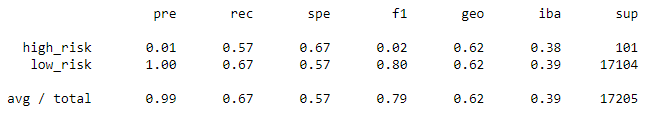

# Credit Risk Analysis

## Resources 
* Python 3.7
* Jupyter Notebook 
* [credit_risk_resampling.ipynb](credit_risk_resampling.ipynb)
* [credit_risk_ensemble.ipynb](credit_risk_ensemble.ipynb)

## Overview of the analysis 
Evaluate the performance of machine learning models applied to predict credit risk. Different techniques, such as, imbalanced-learn and scikit-learn libraries were used to train and evaluate models with unbalanced classes as credit risk is an unbalanced classification problem. A dataset provided by LendingClub was used to oversample and undersample data, observe a combinatorial approach of over and undersampling data, and compare two new models for reducing bias: BalancedRandomForestClassifier and EasyEnsembleClassifier.

## Results - Balanced accuracy, precision, recall scores

* Precision = True Positive/(True Positive + False Positive)
* Recall = True Positive/(True Positive + False Negative)

The results for the naive random oversampling, SMOTE oversampling, undersampling, and combination (over and under) sampling all yielded similar results. All models had an accuracy score between 0.58-0.65, indicating that these 4 models are accurate only 58-65% of the time. The precision for low risk was 1.00 for all 4 models, indicating a high reliability for a positive classification. In contrast, the precision was 0.01 for high risk, indicating a low reliability for positive classification. High precision is likely due to a conservative process where predicted positives are most likely a true positive, but some other true positives may not be predicted. The sensitivity/recall for all 4 models are between 0.57-0.70 for both low and high risk. These scores are not particularly high, indicating the model is not too aggressive. High sensitivity models likely have a high number of false positives. 

###  Naive Random Oversampling 
* Balanced Accuracy Score: 0.65

### SMOTE Oversampling
* Balanced Accuracy Score: 0.62

### Undersampling
* Balanced Accuracy Score: 0.58

### Combination (Over and Under) Sampling
* Balanced Accuracy Score: 0.65

## Extension 

Additional analysis of these 2 models, balanced random forest classifier and ensemble AdaBoost classifier were performed. The balanced random forest classifier had a higher accuracy score in comparison with the first 4 models. Ensemble AdaBoost classifier had the highest accuracy score of 0.94, significantly more accurate than the other 5 models. the precision for high risk has increased to 0.10 for both of these models and remains at 1.00 for low risk. The recall for balanced random forest classifier is 0.54 for high risk, which is similar to the other values from the first 4 models. In contrast, the recall for low risk is 0.94, significantly higher than that of the other 4 models. For the Ensemble AdaBoost Classifier, the recall value is the highest of all models for high risk, at 0.92 and second highest for low risk, at 0.95. 

### Balanced Random Forest Classifier
* Balanced Accuracy Score: 0.74

### Ensemble AdaBoost Classifier
* Balanced Accuracy Score: 0.94

## Summary 
In conclusion, the model recommended for use is the Ensemble AdaBoost Classifier model. Yielding the highest accuracy score and relatively high sensitivity/recall values, this machine learning module is the best model to use. Additional analysis can be done with other supervised learning models. Scaling the data can also be tested to observe any potential differences in the results. 
